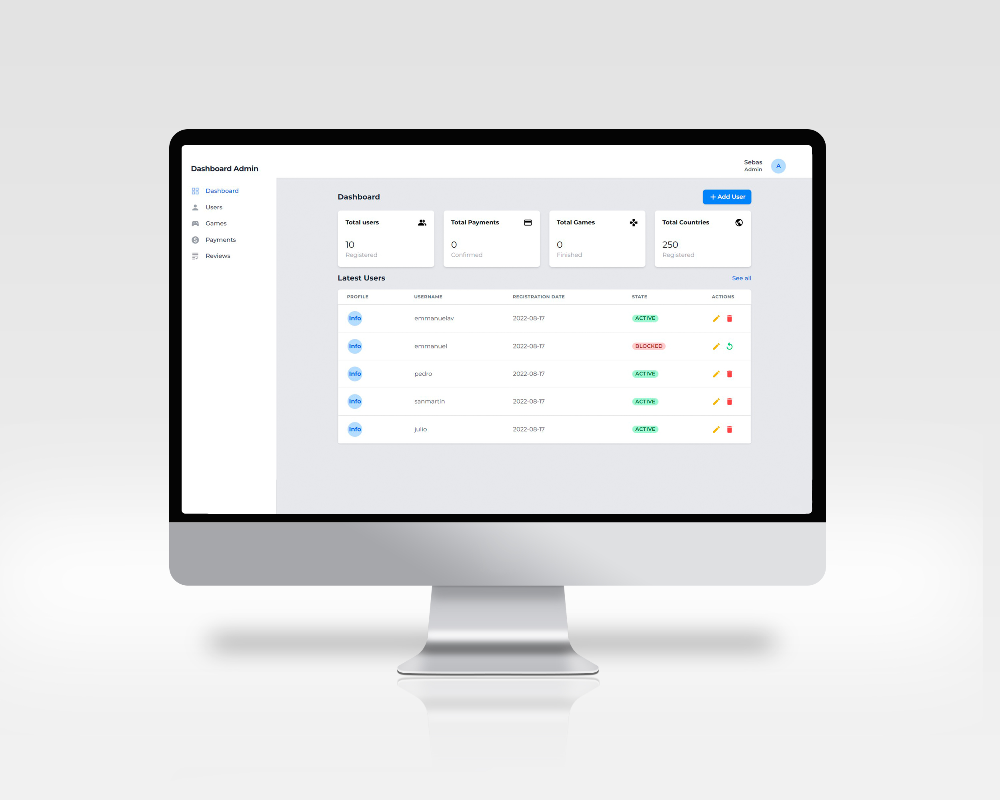

<h1> Hi there 👋, Fermín Schachner here! </h1>

I´m an argentinian Full Stack Developer, with academic experience in web and app developtment. I can speak and work fluently in English and Spanish.

<h2>Tech Skills: </h2>
<ul>
  <li> JavaScript</li>
  <li> ReactJs</li>
  <li> NodeJs</li>
  <li> Redux</li>
  <li> React Native</li>
  <li> Data Structures</li>
  <li> HTML</li>
  <li> CSS</li>
  <li> Tailwind</li>
  <li> Sequelize</li>
  <li> PostgreSQL</li>
  <li> Express</li>
  </ul>
  <h2>Some of my work: </h2>
<h3> World-Game</h3>  

~~~
⚡ Final group project of Bootcamp Henry ⚡ 
I worked as Front-End & Mobile Developer. 

The project has a mobile version, a web version and an administrator panel.

Tech Utils:
🎮 Database: PostgreSQL
🎮 Back-End: NodeJs, Express, Sequelize
🎮 Front-End: React JS, React Native, Redux, Tailwind, Material-UI, HTML
🎮 Additional Libraries: 
✔ Socket-IO (Integrated chat)
✔ Chart.js (Real-time graphs)
✔ Stripe (Payment gateway)
✔ Cloudinary (Upload profile picture)
✔ Nodemailer (Sending of mails)
~~~
<h2>
Mobile Game
</h2>

  

<h2>
Administrator Panel
</h2>

  

 <h3> Contact me: </h3>
 <ul>
  <li>Linkedin: https://www.linkedin.com/in/fermin-schachner</li>
  <li>Email: ferminsch0@gmail.com </li>
  </ul>
 

